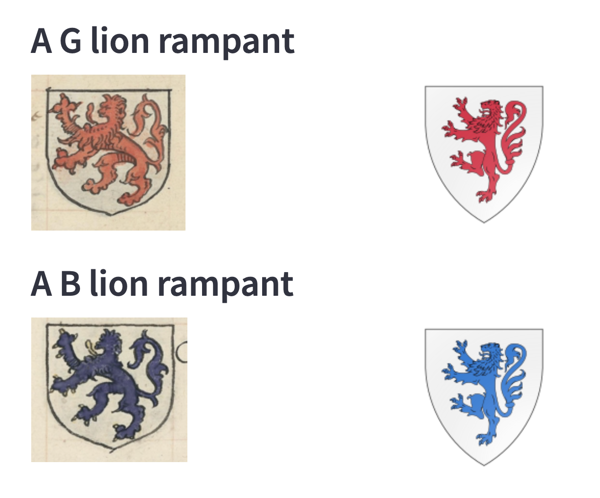
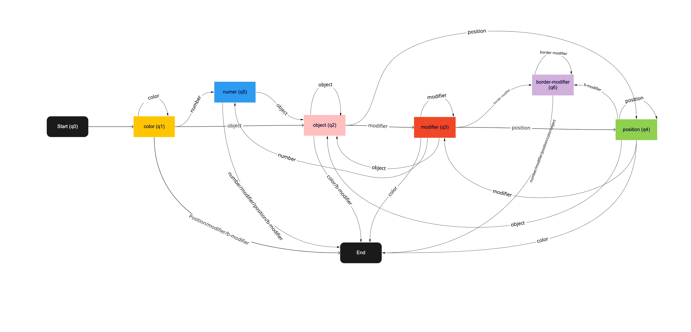
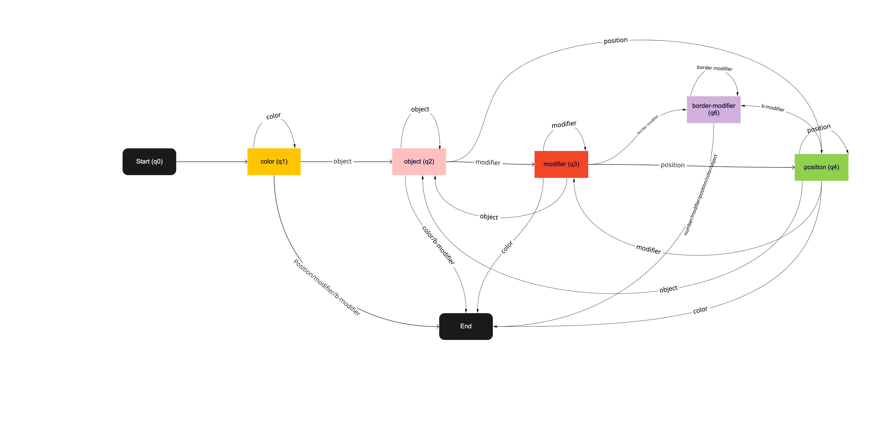

# coat-of-arms

Work in progress 



## Setup Local Environment

1- Get the repo

    git clone git@github.com:safaa-alnabulsi/coat-of-arms.git
    cd coat-of-arms

2- Create virtual enviroment

    python -m pip install -U setuptools pip
    conda create --name thesis-py38 python=3.8
    conda activate thesis-py38
    conda install --file requirements.txt
    
    torchdatasets: pip install automata-lib
    pip install --user torchdatasets
    pip install --user torchdatasets-nightly

    jupyter notebook

3- to run tests

    pytest

4- clone https://github.com/safaa-alnabulsi/armoria-api
    
    npm install --save
    
  then 
  
      npm start

5- to see it visually (needs a dataset in a folder named `data/cropped_coas/out` ):
    
    streamlit run view_crops.py

__Note__: if you want to see results from more than one experiment, you need to run it:

    tensorboard --logdir_spec ExperimentA:path/to/dir,ExperimentB:another/path/to/somewhere

7- to generate dataset

    
    python generate-baseline-large.py --index=40787
    python add-pixels-to-caption.py --index=40787 --dataset baseline-gen-data/medium
    

The default index is 0

## Training the baseline model

- To submit a job to run on one node on the cluster
```sh
     qsub train_baseline.sh /home/space/datasets/COA/generated-data-api-large 256 1 false
```      

- Locally:
```sh
     python train_baseline.py --dataset baseline-gen-data/small --batch-size 256 --epochs 1 --resplit no --local yes
```    

- To check the loss/accuracy while training with tensorboard locally, run the following command
```sh
     tensorboard --logdir=experiments/ --bind_all
```  

The server will start in http://localhost:6006/

- To track the metrics of loss and accuracy in real time:
```sh
     tensorboard --logdir=/home/space/datasets/COA/experiments --bind_all
```       

Check the port and then do ssh forwarding:
```sh
     ssh -L 6012:cluster:6012 <your-email> -i ~/.ssh/id_rsa
```    

Navigate to http://localhost:6012/ in your browser and check the job logs in real time.

## The Automata

The visual representation of the implemented automata in [LabelCheckerAutomata](src/label_checker_automata.py)


The previous simple automata: 


## References:
- automata-lib: https://pypi.org/project/automata-lib/#class-dfafa
- Armoria API: https://github.com/Azgaar/armoria-api
- Early Stopping for PyTorch: https://github.com/Bjarten/early-stopping-pytorch
- torchdatasets: https://github.com/szymonmaszke/torchdatasets
- Torch data-loader: https://www.kaggle.com/mdteach/torch-data-loader-flicker-8k
- Tensorboard: https://pytorch.org/tutorials/recipes/recipes/tensorboard_with_pytorch.html
