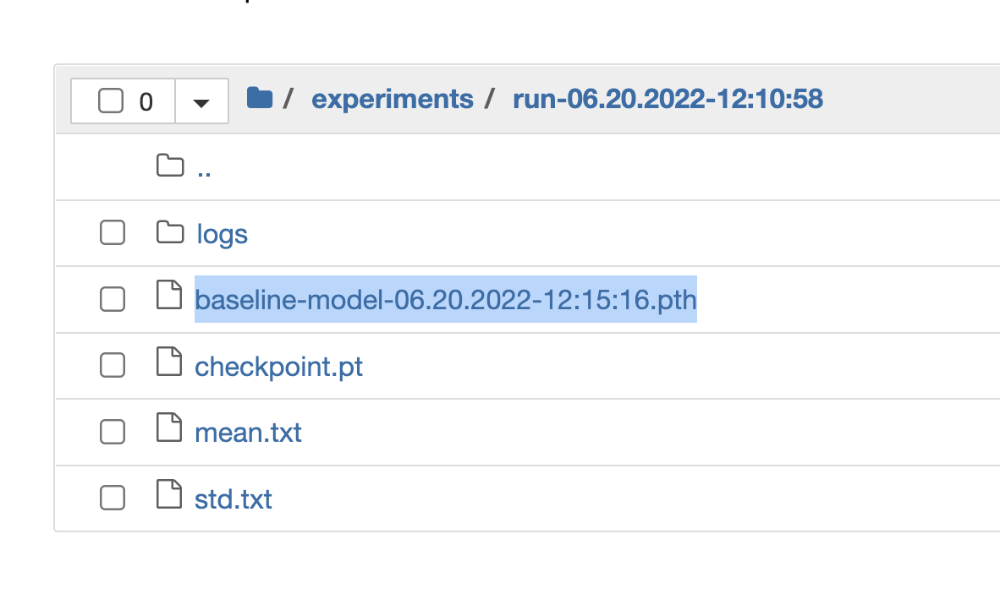

# coat-of-arms

Work in progress 


## Setup Local Environment

1- Get the repo

    git clone git@github.com:safaa-alnabulsi/coat-of-arms.git
    cd coat-of-arms

2- Create virtual enviroment

    python -m pip install -U setuptools pip
    conda create --name thesis-py38 python=3.8
    conda activate thesis-py38
    conda install --file requirements.txt
    
    torchdatasets: pip install automata-lib
    pip install --user torchdatasets
    pip install --user torchdatasets-nightly

    jupyter notebook

3- to run tests

    pytest

4- clone https://github.com/safaa-alnabulsi/armoria-api
    
    npm install --save
    
  then 
  
      npm start

5- to see it visually (needs a dataset in a folder named `data/cropped_coas/out` ):
    
    streamlit run view_crops.py

__Note__: if you want to see results from more than one experiment, you need to run it:

    tensorboard --logdir_spec ExperimentA:path/to/dir,ExperimentB:another/path/to/somewhere

7- to generate dataset

    
    python generate-baseline-large.py --index=40787
    python add-pixels-to-caption.py --index=40787 --dataset baseline-gen-data/medium
    

The default index is 0

## Training the baseline model

- To submit a job to run on one node on the cluster
```sh
     qsub train_baseline.sh /home/space/datasets/COA/generated-data-api-large 256 1 false
```      

- Locally:
```sh
     python train_baseline.py --dataset baseline-gen-data/small --batch-size 256 --epochs 1 --resplit no --local yes
```    

- To check the loss/accuracy while training with tensorboard locally, run the following command
```sh
     tensorboard --logdir=experiments/ --bind_all
```  

The server will start in http://localhost:6006/

- To track the metrics of loss and accuracy in real time:
```sh
     tensorboard --logdir=/home/space/datasets/COA/experiments --bind_all
```       

Check the port and then do ssh forwarding:
```sh
     ssh -L 6012:cluster:6012 <your-email> -i ~/.ssh/id_rsa
```    

Navigate to http://localhost:6012/ in your browser and check the job logs in real time.

## Testing the baseline model

Each run of the training script is stored in the following structure of experiemnts: 


You can use notebook [09-baseline-model-test.ipynb](notebooks/09-baseline-model-test.ipynb) to load the model and test it on both synthesized data and real data.

You can also use [test_baseline.py](test_baseline.py) script to test the model:

### Synthetic data

- Locally:

```bash
python test_baseline.py --dataset ~/tub/coat-of-arms/baseline-gen-data/small --batch-size 516 --local y --run-name 'run-06-22-2022-07:57:31' --model-name 'baseline-model-06-25-2022-20:54:47.pth' --real_data no --resized-images no
```

- On the cluster:

```bash
     qsub test_baseline.sh /home/space/datasets/COA/generated-data-api-large 'run-06-22-2022-07:57:31' 'baseline-model-06-25-2022-20:54:47.pth' 516 no no no
```

### Real data

__Note__: for testing real data, just pass the folder of the dataset to the `dataset` parameter and pass `real_data` as `yes`

- Locally:
```bash
python test_baseline.py --dataset /Users/salnabulsi/tub/coat-of-arms/data/cropped_coas/out --batch-size 256 --local y --run-name 'run-06-22-2022-07:57:31' --model-name 'baseline-model-06-25-2022-20:54:47.pth' --real-data yes  --resized-images no
``` 

- On the cluster:

```bash
     qsub test_baseline.sh /home/salnabulsi/coat-of-arms/data/cropped_coas/out 'run-06-22-2022-07:57:31' 'baseline-model-06-25-2022-20:54:47.pth' 256 no yes no
```

## The Automata

The visual representation of the implemented automata in [LabelCheckerAutomata](src/label_checker_automata.py)


The previous simple automata: 


## Helping scripts

### Dataset generation script

This script generates dataset from permutations. It sends requests to Armoria API and creates `caption.txt` file.

```bash
    python generate-baseline-large.py --index=40787
``` 

### Generate script

This script generates two values `psum, psum_sq` for each image in the given dataset and store the result in a new text file `captions-psumsq.txt`.

* psum: total sum of pixles in the image
* psum_sq: sum of the squared of pixles in the image 

```bash
    python add-pixels-to-caption.py --index=40787 --dataset baseline-gen-data/medium
``` 

### Resizing images script

This script resize the images in the given folder to 100x100 and store them in `res_images`. No params as it's for one-time use. 

- Locally:
```bash
    python resize-images.py
``` 

- On the cluster:

```bash
     qsub resize-images.sh
```

## References:
- automata-lib: https://pypi.org/project/automata-lib/#class-dfafa
- Armoria API: https://github.com/Azgaar/armoria-api
- Early Stopping for PyTorch: https://github.com/Bjarten/early-stopping-pytorch
- torchdatasets: https://github.com/szymonmaszke/torchdatasets
- Torch data-loader: https://www.kaggle.com/mdteach/torch-data-loader-flicker-8k
- Tensorboard: https://pytorch.org/tutorials/recipes/recipes/tensorboard_with_pytorch.html
- baseline model explained: https://towardsdatascience.com/baseline-models-your-guide-for-model-building-1ec3aa244b8d 
- Transfer Learning and Other Tricks: https://www.oreilly.com/library/view/programming-pytorch-for/9781492045342/ch04.html